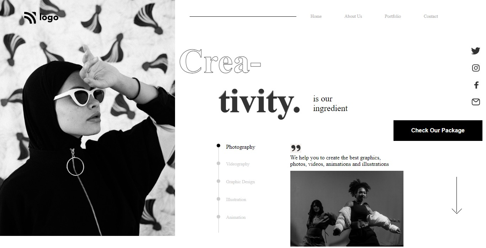
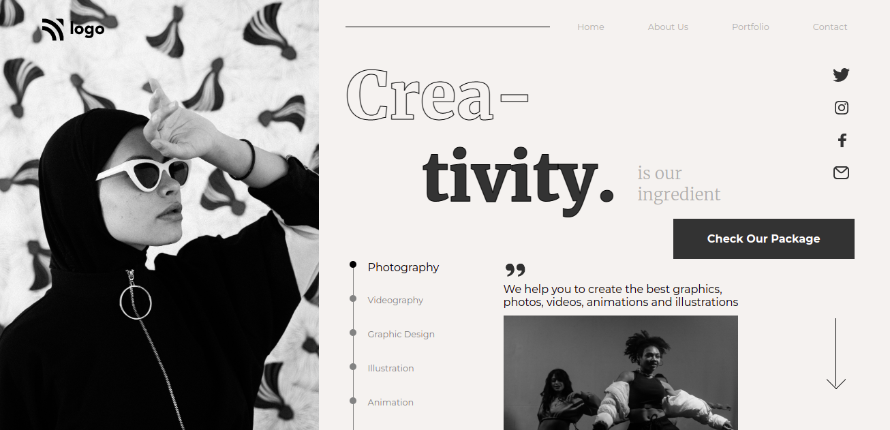

# This is static page 14
## This page is completely build with HTML and CSS(no framework)

### process 
 A thumbnail is given to us with html page and a blank CSS file .All the CSS page is written and designed  by me 

 ### total time to complete
 - took me around 6 hours to complete this page from scratch
### Main techniques learned during this project
-   using common class for design    
-   flex properties
-   margin and padding
-   footer element
-  position items
 ## live link
 [LIVE LINK]("netlify")

 # RESULT
 ## my Result
 
 ## Given
